<h1 align="center">Moonlight Godot</h1>

<h2 align="center">A Godot extension to use moonlight in Godot.</h2>

<p align="center">
  一个基于 Moonlight 协议的 Godot 扩展插件，支持在 Godot 中直接使用 Moonlight 进行游戏串流。
</p>

# 架构

Moonlight Godot 的底层基于 Moonlight 的协议实现，利用了 FFmpeg、cURL 等开源库进行串流。其整体架构分为以下几个模块：



## 核心模块说明：
- **MoonlightConfigManager**: 负责本地序列化存储，保存局域网内已发现的主机配置及已建立的 MTLS 证书。
- **MoonlightComputerManager**: 负责与远程 PC 进行通讯。使用该模块用于对 PC (Sunshine / Nvidia GFE) 发起握手、状态查询、以及复杂的验证挑战配对流程 (`start_pair()`)。
- **MoonlightStreamCore**: 串流生命周期管理。在连接后与主机进行直接 RTSP 推拉流，将底层的视频解码数据推给 Godot 显示，音频转发至 `AudioStream` 或 `miniaudio`，并将本地键鼠/手柄输入反向传达到主机。

# Deepwiki
[](https://deepwiki.com/html5syt/Moonlight-Godot/)

# 使用方法

> 建议同时参考插件提供的内置类参考文档及demo！
> 
> demo中`main.tscn`为基础的2D串流示例，`main3D.tscn`为3D场景中视频纹理的示例，`mainMulti.tscn`为多实例串流示例。`main3D-SteamAudio.tscn`为集成了SteamAudio插件的3D场景示例。SteamAudio插件可前往[这里](https://github.com/stechyo/godot-steam-audio)获取,demo中默认不包含该插件。

## 1. 安装插件

### 从 Godot AssetLib 安装（推荐）

1. 在 Godot 编辑器中打开 AssetLib（资产库）。
2. 搜索 "Moonlight Godot" 插件。
3. 点击安装并按照提示完成安装。
4. 安装完成后，重载项目，插件应立即可用。

### 从 Release 页面下载（推荐）

1. 从[Release](https://github.com/html5syt/Moonlight-Godot/releases)页面下载最新版本的对应目标平台的插件 zip 包。
2. 将其解压后放入您项目中的 `addons/` 目录下。
3. 重载项目，插件应立即可用。

### 从Github Actions构建并下载

1. 访问[Actions](https://github.com/html5syt/Moonlight-Godot/actions)页面，找到最新的`Build Moonlight GDExtension`构建任务。
2. 点击进入该构建任务，拉到最下方的`Artifacts`部分
3. 选择合适的目标系统和架构并下载插件zip包。
4. 将插件文件解压后放入您项目中的 `addons/` 目录下。
5. 重载项目，插件应立即可用。

### 从源码构建

1. 克隆本仓库到本地。
2. 安装vcpkg用于安装依赖，安装cmake、MSVC、Ninja等必要的编译工具。
3. 使用`/CMakePresets.json`构建对应平台的插件版本。
4. 将`/bin`下的构建产物复制到您项目中的 `addons/` 目录下。
5. 重载项目，插件应立即可用。

## 2. 服务器配置预检与配对 
在你开启串流前，必须确保 PC 端已安装 [Sunshine](https://github.com/LizardByte/Sunshine)（推荐）或 GeForce Experience 的 GameStream 并处于运行状态。

首先需要初始化配置管理器与设备管理器进行绑定，发起配对握手：
```gdscript
# 构建并初始化 ConfigManager (这负责证书存取与配对密钥缓存)
var moonlight_config_manager = MoonlightConfigManager.new()

# 构建并初始化 ComputerManager 用于网络交互与握手挑战
var moonlight_computer_manager = MoonlightComputerManager.new()
moonlight_computer_manager.set_config_manager(moonlight_config_manager)

# 监听配对完成事件
moonlight_computer_manager.pair_completed.connect(_on_pair_complete)

# 发起配对，传入主机的局域网 IP
var pin = moonlight_computer_manager.start_pair("192.168.1.100")
print("在 Sunshine 或者 Nvidia 弹窗中填入这个 PIN 码完成配对: ", pin)

func _on_pair_complete(success: bool, message: String):
    if success:
        print("配对成功！")
    else:
        push_error("配对失败: ", message)
```
注意：如果需要取消配对，可以调用 `unpair(host_id)`。

## 3. 获取应用列表及应用封面
配对完成后，可以通过设备 ID 获取主机上开放串流的应用列表以及其对应的封面图片（用于构建 UI 界面）：

```gdscript
# 通过配置id请求 App 列表
moonlight_computer_manager.get_app_list(1)

# 获取某一特定应用的封面并绑定到你的 TextureRect
var apps = moonlight_config_manager.get_apps(1)
if apps.size() > 0:
    moonlight_computer_manager.get_app_cover(1, apps[0]["id"], func(texture_return): 
        $YourTextureRect.texture = texture_return
    )
```

## 4. 建立并控制视音频串流
配对通过后，即可通过 `MoonlightStreamCore` 获取并开启具体的 App。
建立完整的串流需要利用对应的资源配置（资源描述分辨率、帧率与附加标志等）。

- **开始串流**：建立底层 Stream Core 连接：
  ```gdscript
  var stream_core = MoonlightStreamCore.new()
  stream_core.set_config_manager(moonlight_config_manager)
  
  # 步骤 1. 配置分辨率、帧率与比特率（例如：20Mbps）
  var cfg = MoonlightStreamConfigurationResource.new()
  cfg.set_width(1920)
  cfg.set_height(1080)
  cfg.set_fps(60)
  cfg.set_bitrate(20000 * 1000) 
  cfg.set_audio_configuration(MoonlightStreamConfigurationResource.AUDIO_CFG_71_SURROUND) # 开启7.1声道支持
  
  # 步骤 2. 配置附加参数（启用硬件解码等属性）
  var add_opts = MoonlightAdditionalStreamOptions.new()
  add_opts.set_disable_hw_acceleration(false) # 启用硬件加速
  # 根据需要可禁用视频或音频以节省带宽：
  # add_opts.set_disable_video(false)
  # add_opts.set_disable_audio(false)
  
  # 步骤 3. 绑定视频渲染目标 (例如到一个 TextureRect，也可以绑定到 ScreenMesh 的 Viewport)
  stream_core.set_render_target($UI/TextureRect)
  
  # 步骤 4. 启动串流 (传入 host_id 和 app_id)
  stream_core.start_play_stream(1, 1191261554, cfg, add_opts)
  
  # 步骤 5. 绑定 Godot 的声音节点播放串流音频
  # 需等待片刻让串流成功建立并获得音频流对象
  await get_tree().create_timer(1).timeout
  $YourAudioStreamPlayer.stream = stream_core.get_audio_stream()
  $YourAudioStreamPlayer.play()
  # (如果需要声道分离，可使用 get_audio_streams() 返回数组挂载到多个 AudioStreamPlayer3D)
  ```

- **断开串流**：串流结束调用：
  ```gdscript
  moonlight_computer_manager.stop_stream(1, func(info):
      print("Steam stopped: ", info)
      stream_core.stop_play_stream()
      stream_core.reset_audio_stream()   # 释放音频轨道防止内存泄漏或野指针
      stream_core.reset_render_target()  # 释放渲染目标的残留画面
  )
  ```

## 5. 高性能与 3D 渲染适配
- **音频直通引擎 (Native Audio Bypass)**：为了达到极致低延迟，你可以直接开启音频直通 (基于[miniaudio](https://github.com/mackron/miniaudio)实现)。
  ```gdscript
  if not stream_core.is_native_audio_bypass_running():
      stream_core.start_native_audio_bypass()
  ```
  在原生音频旁路运行期间，你还可以随时对其执行 `pause_native_audio_bypass()` 与 `resume_native_audio_bypass()`。
- **三维场景视频输出**：渲染目标无需局限于单纯的 UI `TextureRect`。你完全可以通过 `SubViewport` 的 `get_texture()` 将视频当作纹理赋予给任意的一个 3D 模型材质，材质建议调整为 **无光照模式(Unshaded)** 以正确映射视频原本颜色亮度。详见演示文件 `main3D.gd`。

## 6. 输入透传 (Input Bridge)
在 Godot 中所有的鼠标、触控、手柄与键盘均能完美桥接到 Moonlight 云端，直接捕捉 Godot 提供 `InputEvent` 对象再转发给核心接口即可：
```gdscript
func _input(event: InputEvent) -> void:
    # 实体键盘的透传
    if event is InputEventKey:
        var action = MoonlightInput.KEY_ACTION_DOWN_LIMIT if event.pressed else MoonlightInput.KEY_ACTION_UP_LIMIT
        var modifiers = 0 # (按需封装 Shift/Ctrl/Alt 掩码，见 MoonlightInput.MODIFIER_SHIFT_BIT)
        stream_core.send_keyboard_event(event.keycode, action, modifiers)
    
    # 鼠标位移透传（需提前通过 Input.set_mouse_mode 捕获鼠标）：
    elif event is InputEventMouseMotion:
        # 可以发送绝对位置 send_mouse_position_event，或者相对位移 send_mouse_move_event
        stream_core.send_mouse_move_event(event.relative.x, event.relative.y)

    # 以及鼠标按键
    elif event is InputEventMouseButton:
        # 参考 MoonlightInput.MouseButton 和 MouseButtonAction.MOUSE_BUTTON_ACTION_PRESS
        stream_core.send_mouse_button_event(action, button_id)
```

## 7. 多实例串流
Moonlight Godot 深度优化了解耦逻辑，你可以轻而易举地在一套程序内通过开辟多个 `MoonlightStreamCore` 实例并将其配置重定向至不同的 `config_path` (`user://cfg1.ini`, `user://cfg2.ini`)，以实现**多实例（单程序多客户端）串流**。详尽写法可参考内置演示 `mainMulti.gd`。

**注意** ：由于moonlight-common-c协议库的限制，多实例串流不能并发进行，单个程序内同时只能有**一路活动的连接**。

# 配置文件

Moonlight Godot 使用 INI 格式、Qt风格的配置文件来存储主机信息、配对密钥和应用列表等数据。默认配置文件路径为 `user://moonlight_config.ini`，你也可以通过 `set_config_path(path)` 方法指定自定义路径。

示例：

```ini
[General]

certificate="@ByteArray(<你的公钥>)"
key="@ByteArray(<你的私钥>)"
uniqueid="D407745D8E7BD2ED"

[hosts]

size=1
1\hostname="127.0.0.1"
1\localaddress="127.0.0.1"
1\uuid="faac23c8cbc688982407572a560943aa"
1\srvcert="@ByteArray(<你的服务端证书>)"
1\https_port=47984
1\server_unique_id="F98186B1-DE02-2328-279E-0A461FBCEC47"
1\apps\size=3
1\apps\1\name="桌面"
1\apps\1\id=1191261554
1\apps\2\name="Milthm"
1\apps\2\id=705288528
1\apps\3\name="Rizline"
1\apps\3\id=1145141919

```

其中 `[General]` 部分存储了全局的配对证书和密钥信息，而 `[hosts]` 部分则以主机 ID 为索引，存储了每个主机的 IP 地址、名称、设备 ID、服务端证书以及该主机上可串流的应用列表等信息。

在代码中，你可以通过 `MoonlightConfigManager` 提供的接口来访问和修改这些配置数据，例如：
    
```gdscript
# 获取主机列表
var hosts = moonlight_config_manager.get_hosts()
# 获取特定主机的应用列表
var apps = moonlight_config_manager.get_apps(host_id)
```

主机列表的每一项包含主机的 IP 地址、名称、设备 ID 和配对密钥等信息。应用列表则包含每个可串流应用的 ID、名称和其他元数据。其索引顺序与串流核心接口中**使用的 host_id 保持一致**，确保你在调用串流接口时能够正确地引用到对应的主机和应用。

# 声明与许可
**本插件以 "AS IS" (按原样) 方式提供，不提供任何明示或暗示的保证。** 
因使用该扩展产生的任何数据丢失、设备损坏或安全连带问题，作者不承担任何责任。

**作者**: Mr. Tim

**许可证**: [MIT License](LICENSE.md)

# 反馈
如果遇到 BUG 或希望提交特性请求，请访问本仓库的 [Issue](https://github.com/html5syt/Moonlight-Godot/issues) 页面提交反馈。

## Star History

<a href="https://www.star-history.com/?repos=html5syt%2FMoonlight-Godot&type=date&legend=top-left">
 <picture>
   <source media="(prefers-color-scheme: dark)" srcset="https://api.star-history.com/chart?repos=html5syt/Moonlight-Godot&type=date&theme=dark&legend=top-left" />
   <source media="(prefers-color-scheme: light)" srcset="https://api.star-history.com/chart?repos=html5syt/Moonlight-Godot&type=date&legend=top-left" />
   
 </picture>
</a>
